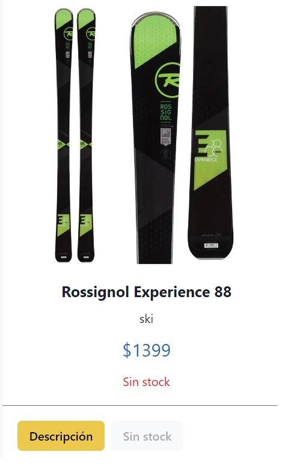
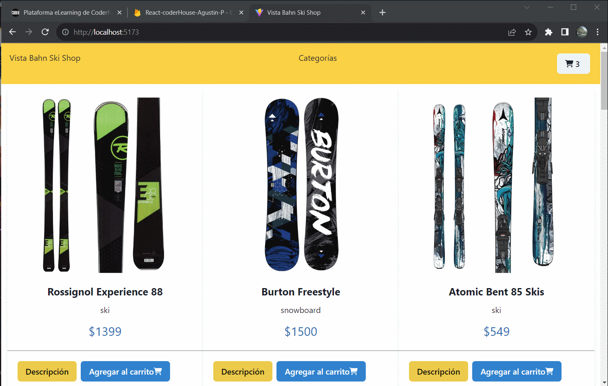

# Tienda de Ski y snowboard
<p>Este proyecto fue realizado como proyecto final para el curso de React en CoderHouse.</p>
<p>Consiste en una simulación de un e-commerce que vende productos de Ski y Snowboard</p>
<p>Tiene una vista de todos los productos, un filtrado por categorias, una descripcion detallada de cada producto y un carrito para finalizar la compra.</p>
<p>Ademas tiene un manejo de rutas por categoria y ID, y esta conectado a FireBase como base de datos, desde donde se obtienen los productos y a donde se manda la orden de compra.</p>

## Funcionalidades 
<p>-El componente itemCount verifica que el contador no pueda sobrepasar la cantidad de stock del producto.<p>


```javascript
const increment = () => {
        if (quantity == stock) {
            toast({
                position: 'top-right',
                title: "No hay stock suficiente",
                status: "error",
                isClosable: true,
            });

        }
        if (quantity < stock) {
            setQuantity(quantity + 1)
        }
    }
``````

<p> -El componente Form vuelve a verificar que el stock del producto que se esta enviando a BD como compra este realmente disponible (para evitar comprar en dos pestañas diferentes y saltearse la verificacion de itemCount)<p>

```javascript
try {
            for (const item of cart) {
                const productDocRef = doc(db, 'products', item.id);
                const productDocSnapshot = await getDoc(productDocRef);

                if (!productDocSnapshot.exists()) {
                    throw new Error('Producto no encontrado en la base de datos.');
                }

                const productData = productDocSnapshot.data();
                const productStock = productData.stock;

                if (item.cantidad > productStock) {
                    Swal.fire({
                        icon: 'error',
                        title: 'Error en la compra',
                        text: `El producto "${productData.nombre}" ya no está disponible en stock.`,
                        timer: 3000,
                        timerProgressBar: true,
                        allowOutsideClick: false,
                    });
                    return;
                }
            }

``````
<p>-Cuando un producto tiene stock =0 aparece como "sin stock" tanto en la vista general como en la vista de detalle. Ademas no permite agregar ese producto al carrito ya que aparece el boton griseado. <p>



<p>-El formulario de confirmacion de compra pide email dos veces y verifica que ambos coincida. Ademas es necesario llenar todos los campos para poder finalizar la compra exitosamente. De caso contrario arroja un sweet alert.

 


## Gifs de funcionamiento 
<p>Funcionamiento de la vista general, detalle y filtrado</p>


<p>Funcionamiento del carrito, verificacion de informacion en el formulario y checkout</p>

